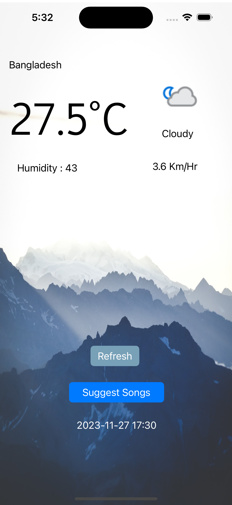
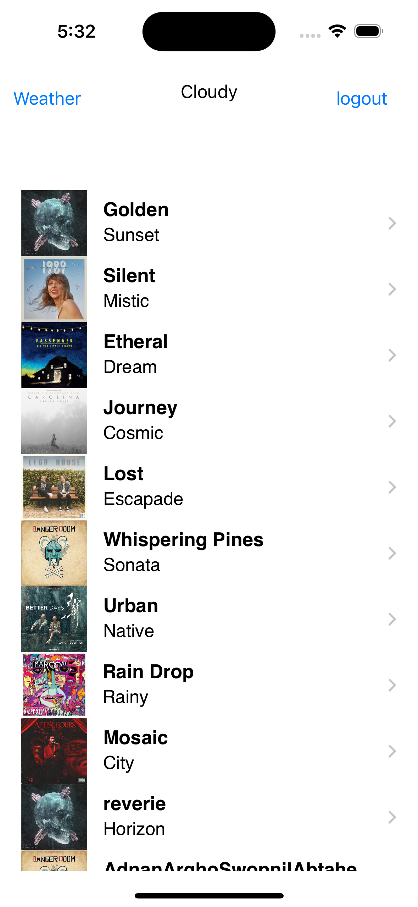
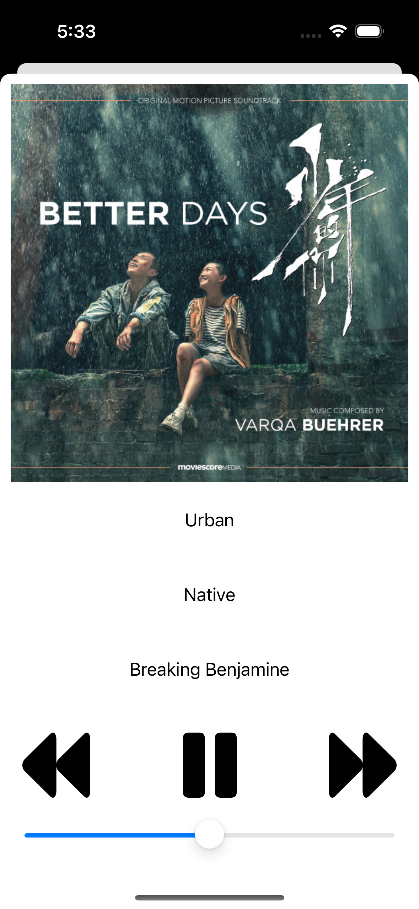
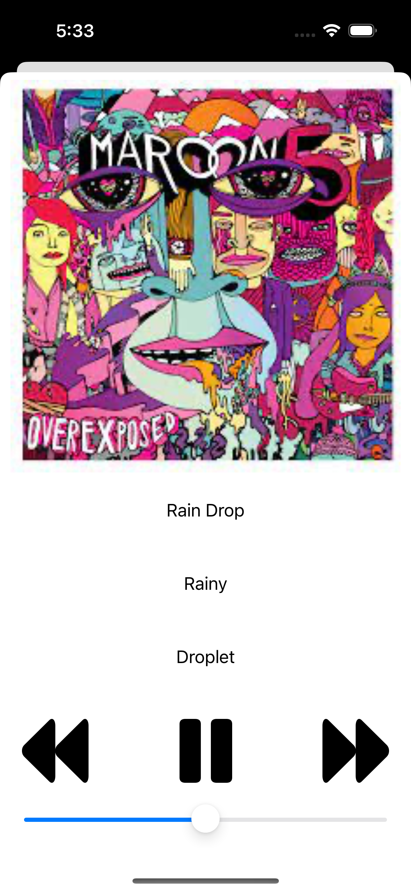

# MoodRythm

MoodRythm is an iOS application that enriches your music listening experience by curating personalized playlists based on real-time weather conditions. This app aims to establish a harmonious connection between your mood and the atmospheric ambiance, providing you with a unique and dynamic soundtrack tailored to the weather.

## Features

- **Weather-based Playlists:** Enjoy music recommendations adjusted to the current weather, creating an immersive listening experience.
  
- **Personalized Suggestions:** Receive curated playlists based on your preferences and the atmospheric conditions, ensuring a personalized music journey.

- **Seamless Integration:** Intuitive design and user-friendly interface for easy navigation and a smooth user experience.

- **Real-time Updates:** Constantly updates playlist suggestions as the weather changes, ensuring an ever-evolving soundtrack to complement your mood.

## Screenshots

  
  
  
  
  
  
  
  

## Credits

MoodRythm is developed by the following individuals, each of whom contributed equally to its creation:

1. [Soummo Bhattacharya](https://github.com/SoummoSsj)
2. [Md. Rakibul Hasan Adnan](https://github.com/RakibHasan106)
3. [Mohammad Abtahe Alam](https://github.com/Abtahe103)
4. [Aciful Islam Khan Swopnile](https://github.com/Elin-powS)
5. [Saugata Roy Arghya](https://github.com/saugataroyarghya)

---

---

Thank you for using MoodRythm! We hope you enjoy your personalized music experience based on the weather. If you encounter any issues or have suggestions for improvement, please let us know.

